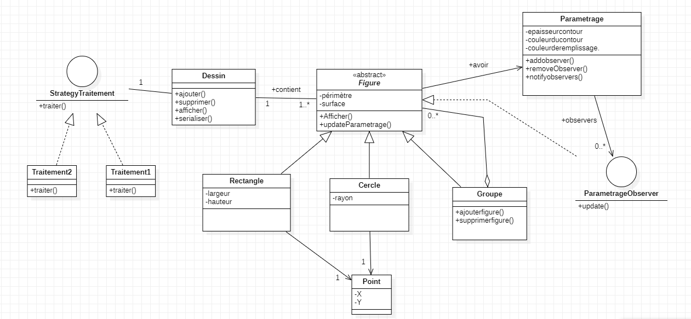
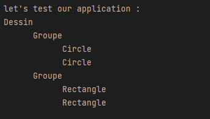
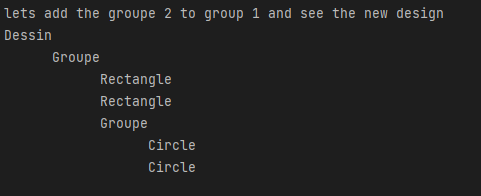

Class diagram ✔

<br>

<br>

Whaaaat is this brooo !! 😑😑

Wait Wait everything going to be fine after this article man 😅😅


To make it easy to understand this diagram we are going to test each part and explain the choice of design pattern.
yeeep keep reaaading bro 😜
## Tests :

The first thing we will do is testing the composite design pattern.
This pattern is used because we know that a figure could be a simple circle or rectangle or group of them .
so the group of figures will be treated in the same way as a single instance.

### Test 1 :

```java
package com.benyissa;

public class Main {


    public static void main(String[] args) {
        System.out.println("let's test our application :");

        Dessin dessin = new Dessin();

//        let's create two circles first
        Circle circle1 = new Circle(5, new Point(0, 0));
        Circle circle2 = new Circle(5, new Point(1, 0));

//        let's group them
        Groupe groupe1 = new Groupe();
        groupe1.ajouterfigure(circle1);
        groupe1.ajouterfigure(circle2);

//        let's create two circles rectangles
        Rectangle rectangle1 = new Rectangle(4, 4, new Point(1, 1));
        Rectangle rectangle2 = new Rectangle(4, 4, new Point(1, 1));

//        let's group them
        Groupe groupe2 = new Groupe();
        groupe2.ajouterfigure(rectangle1);
        groupe2.ajouterfigure(rectangle2);

// let's add eveything to the dessin

        dessin.ajouterfigure(groupe1);
        dessin.ajouterfigure(groupe2);
//        yeep here we will see the content of our design
        dessin.afficher();
    }
}

```

Resultat :

<br>

<br>

### Test 2 :

```java
        System.out.println("lets add the groupe 2 to group 1 and see the new design ");
        Dessin dessin2=new Dessin();
        groupe2.ajouterfigure(groupe1);
        dessin2.ajouterfigure(groupe2);
        dessin2.afficher();

```

Resultat :


<br>

<br>
