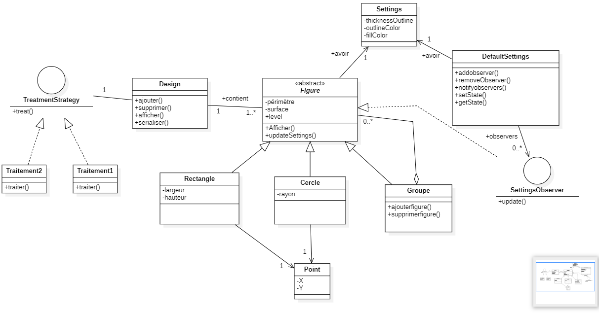
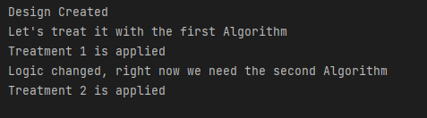
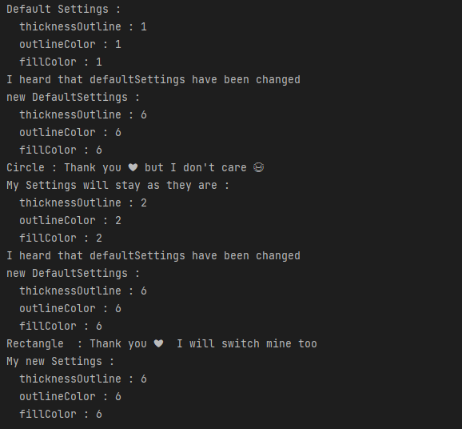

Class diagram ✔

<br>

<br>

Whaaaat is this brooo !! 😑😑

Wait Wait everything going to be fine after this article man 😅😅


To make it easy to understand this diagram we are going to test each part and explain the choice of design pattern.
yeeep keep reaaading bro 😜
## Tests :

The first thing we will do is testing the composite design pattern.
This pattern is used because we know that a figure could be a simple circle or rectangle or group of them .
so the group of figures will be treated in the same way as a single instance.

### Test 1 :

```java
package com.benyissa;

import com.benyissa.app.*;

public class Main {


    public static void main(String[] args) {
        System.out.println("let's test our application :");

        Dessin dessin = new Dessin();

//        let's create two circles first
        Circle circle1 = new Circle(5, new Point(0, 0));
        Circle circle2 = new Circle(5, new Point(1, 0));

//        let's group them
        Groupe groupe1 = new Groupe();
        groupe1.ajouterfigure(circle1);
        groupe1.ajouterfigure(circle2);

//        let's create two circles rectangles
        Rectangle rectangle1 = new Rectangle(4, 4, new Point(1, 1));
        Rectangle rectangle2 = new Rectangle(4, 4, new Point(1, 1));

//        let's group them
        Groupe groupe2 = new Groupe();
        groupe2.ajouterfigure(rectangle1);
        groupe2.ajouterfigure(rectangle2);

// let's add eveything to the dessin

        dessin.ajouterfigure(groupe1);
        dessin.ajouterfigure(groupe2);
//        yeep here we will see the content of our design
        dessin.afficher();
    }
}

```

Result :


<br>

<br>

### Test 2 :

```java
        System.out.println("lets add the groupe 2 to group 1 and see the new design ");
        Dessin dessin2=new Dessin();
        groupe2.ajouterfigure(groupe1);
        dessin2.ajouterfigure(groupe2);
        dessin2.afficher();

```

Result :

<br>

<br>

### Test 3:
We know that our design will be treated using many ways as required 🧐

Yeah It's a strategy pattern, our design will be linked with the TreatmentStrategy interface and each time we can set the wanted implementation to treat it 🤷‍♂️ 

```java
public static void main(String[] args) {
        Dessin dessin = new Dessin();
        System.out.println("Design Created ");
        System.out.println("Let's treat it with the first Algorithm ");
        dessin.setTreatmentStrategy(new TreatmentStrategyImpl1());
        dessin.applyTreatment();
        System.out.println("Logic changed, right now we need the second Algorithm ");
        dessin.setTreatmentStrategy(new TreatmentStrategyImpl2());
        dessin.applyTreatment();
        }
```

Result :

<br>

<br>

### Test 4:
If you check the class diagram you may notice that each figure has its own settings(color ...), but to make life easy we
made another class default settings that the designer can use for all their shapes, but each time we change these settings,all shapes should be notified, then they can do whatever they want, maybe they will keep their own settings or use the new default settings.

Yeeep 😉 It's the world of observability, one of the famous behavioral design patterns ❤.

```java
package com.benyissa.tests.observer;

import com.benyissa.app.*;

public class Test1 {

    public static void main(String[] args) {

//        let's create and display default settings
        DefaultSettings defaultSettings = new DefaultSettings();
        System.out.println("Default Settings : ");
        System.out.println(defaultSettings.getState());
//        let's create two shapes

        Circle circle1 = new Circle(5, new Point(0, 0));
        Rectangle rectangle1 = new Rectangle(4, 4, new Point(1, 1));

//        let's give them new settings
        circle1.setSettings(new Settings(2, 2, 2));
        rectangle1.setSettings(new Settings(4, 4, 4));

//      let's add circle 1 and rectangle 1 as observers of default settings
        defaultSettings.addObserver(circle1);
        defaultSettings.addObserver(rectangle1);

//        let's change the default settings
        defaultSettings.setState(6, 6, 6);

//      here we go,let's notify observers and see their behaviors

        defaultSettings.notifyObservers();

//        if you check the update function of circle and rectangle when they get notified
//        you will find that circles don't care about default settings but rectangles do

    }
}

```

Result :

<br>

<br>


Thank you for reading and keep learning ❤

## 🔗Find me 🤪 :
[](https://www.linkedin.com/in/hamzaaitbenyissa/)
[](https://twitter.com/h_aitbenyissa)
[](https://benyissa.com)
